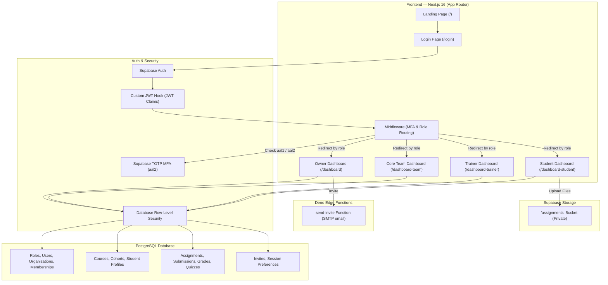
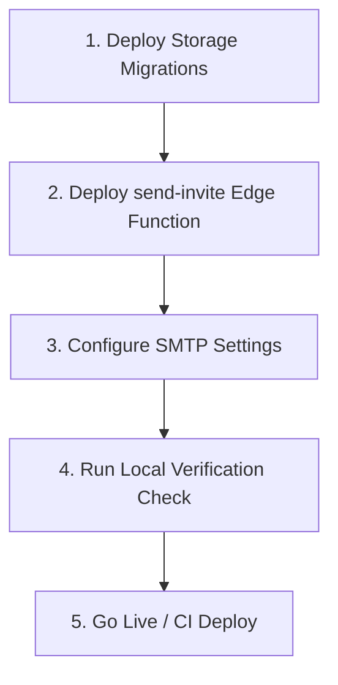

# Solutiions LMS — Product Architecture & Feature Documentation

This document serves as the comprehensive Product Requirements Document (PRD) and Architecture Handbook for **Solutiions LMS**. It covers all user roles, frontend routing, database schema, Row-Level Security (RLS) policies, storage buckets, Deno Edge Function integrations, and lists the concrete steps required to deploy the system production-ready.

---

## 1. Product Overview & Architecture

Solutiions LMS is a multi-tenant Learning Management System designed for educational organizations. It separates platform-level roles, academies, courses, cohorts, and evaluations under strict access control boundaries.

### 1.1 High-Level Architecture Flow



---

## 2. Core Feature Inventory by Role

The platform provides role-based access control (RBAC) to ensure that users are presented with only the information relevant to their permissions.

### 2.1 Owner Dashboard (`/dashboard`)
*   **Target Persona**: Organization Admins & Founders.
*   **Key Features**:
    *   **Live Metrics Panel**: Displays total cohorts, active students, assignments, and trainers computed dynamically from live database schemas.
    *   **Interactive Invite Flow**:
        *   An inline, step-up MFA-gated dialog allowing owners to invite new members (`Owner`, `Core Team`, `Trainer`, `Student`).
        *   Toggles between sending an automated SMTP invite email via Deno Edge Functions and generating a direct copyable link (RPC fallback).
    *   **Team Directory**: Lists all organization memberships. Allows revoking/reinstating access, with TOTP verification triggers protecting sensitive user modifications.
    *   **Platform Structuring**: Dedicated, live-wired sections for Schools, Courses, Trainers, Students, and Reports.

### 2.2 Core Team Dashboard (`/dashboard-team`)
*   **Target Persona**: Operational staff and program managers.
*   **Key Features**:
    *   **Metrics Ledger**: Real-time stats on students, schedules, and active courses.
    *   **Course Catalog**: Tracks active courses and cohorts assigned within their active organization scope.
    *   **Student Registry**: Read-write access to student profiles, directories, and cohort enrollment details.

### 2.3 Trainer Dashboard (`/dashboard-trainer`)
*   **Target Persona**: Instructors, educators, and graders.
*   **Key Features**:
    *   **Cohort Tracker**: View details for cohorts they are assigned to instruct.
    *   **Grading Desk**:
        *   Expandable submission review list segmented by *Awaiting Review* and *Graded* tabs.
        *   Interactive score panel matching the assignment guidelines. Checks that score is between `0` and `max_score` via backend database constraints.
    *   **Student Progress Logs**: Track attendance, class schedules, and project timelines.

### 2.4 Student Dashboard (`/dashboard-student`)
*   **Target Persona**: Learners enrolled in courses.
*   **Key Features**:
    *   **Cohort Hub**: Overview of courses, schedules, and grading trends.
    *   **Assignments Desk**:
        *   Lists assignments categorized by *Todo*, *Awaiting Review*, and *Graded* status.
        *   **Solution Upload panel**: Input text answers/repository URLs and upload a physical file (e.g. PDF, ZIP, PNG, MP4) directly into private Supabase Storage.
    *   **Profile Editor**: Allows updating their name, syncing the JWT payload on-the-fly via user metadata triggers.

---

## 3. Under the Hood — Technical Wire-Up

### 3.1 Authentication & Next.js Middleware
*   **JWT Custom Claims**: Handled through a database function hooked to Supabase Auth. It inserts the active `organization_id`, `role_code`, and `membership_status` directly into the user session token.
*   **Role Routing Middleware**: `middleware.ts` intercepts requests. If a user tries to access `/dashboard-trainer` but has a `student` role claim, it redirects them to `/unauthorized` or `/dashboard-student`.
*   **MFA Gate**: If a route requires high-level MFA verification (e.g. executing admin invites or membership revocation), the middleware forces redirect to `/mfa-challenge` to establish an `aal2` session.

### 3.2 Secure Storage Bucket (`assignments`)
*   Files are stored privately under the path: `{assignment_id}/{auth.uid()}/{filename}`.
*   **INSERT RLS Policy**: Active students can upload files *only* to their own directory, and *only* if they belong to the cohort the assignment belongs to.
*   **DELETE/UPDATE RLS Policy**: Allows students to replace or delete files *only* before a trainer has graded the submission. Once graded, the database blocks all modifications.
*   **SELECT RLS Policy**: Owners, admins, and assigned trainers have full read permission on the files, while students can only retrieve their own.

### 3.3 Invitation Engine & Fallback Flow
*   **Edge Function**: Invokes a Deno handler (`send-invite`) with user credentials. The function handles SMTP email generation using private credentials and records the invitation link.
*   **Client Invocation**:
    1.  Tries `sendInviteEmail()` edge function helper in `frontend/lib/mutations.ts`.
    2.  If the Edge Function is missing, times out, or fails, the client catches the error and issues a fallback request to `createInvite()` (the direct SQL RPC).
    3.  A copyable link is generated so the administrator is not blocked from provisioning users.

---

## 4. Current Implementation Status

All developmental tasks on the codebase have been completed:
1.  **Schema Migration**: Core schema and assessment structures are fully applied.
2.  **Dashboard Refactoring**: Swapped mock data arrays for Next.js react hooks calling live tables.
3.  **MFA Triggers & Modals**: Inline step-up MFA flows completed for admin actions.
4.  **Storage Integration**: Added HTML file input and upload logic for student submissions.
5.  **CI Pipeline**: Configured GitHub Actions to run type safety checks on each pull request.

---

## 5. Next Steps Roadmap for the User

To take the project live and verify full end-to-end user journeys, perform the following steps:



### Step 1: Deploy Storage SQL Migrations
Apply the storage security policies onto your hosted Supabase instance.
1.  Open the [Supabase Dashboard](https://supabase.com).
2.  Go to the **SQL Editor**.
3.  Copy and run the contents of [supabase/migrations/20260620000011_storage_setup.sql](file:///Users/preetam/Desktop/lms/supabase/migrations/20260620000011_storage_setup.sql). This will provision the private `assignments` bucket and bind the RLS policies to `storage.objects`.

### Step 2: Deploy the `send-invite` Deno Edge Function
Deploy the invite function to handle automated email delivery.
1.  Install the Supabase CLI locally.
2.  Log in and link your project:
    ```bash
    supabase login
    supabase link --project-ref your-supabase-project-ref
    ```
3.  Deploy the function:
    ```bash
    supabase functions deploy send-invite
    ```

### Step 3: Configure SMTP Credentials
Make sure Supabase is set up to send custom emails.
1.  In the Supabase Dashboard, go to **Settings** > **Auth**.
2.  Under **SMTP Settings**, enable SMTP and fill in your email provider's credentials (e.g. Resend, SendGrid, Amazon SES).
3.  This ensures that when the `send-invite` function executes, emails are dispatched reliably to your users.

### Step 4: Run End-to-End Local Verification
Execute a manual trial run on the dev server:
1.  Run the Next.js development server:
    ```bash
    npm run dev
    ```
2.  **Invite Verification**: Go to `/dashboard/team` as an Admin. Invite a mock user email. Verify that an email is received, or copy the direct link generated by the RPC fallback.
3.  **Onboarding**: Open the generated invitation link in an incognito window, sign up, and confirm that the user is correctly assigned to the organization.
4.  **Submission & File Upload**: Log in as a student. Open an active assignment, select a test file (e.g., PDF/PNG), type a submission message, and click **Submit Solution**. Verify in the Supabase Dashboard that the file is present in the `assignments` bucket under the folder `{assignment_id}/{user_id}/`.

### Step 5: CI Deployment
Push the code to your GitHub Repository. The newly configured [ci.yml](file:///Users/preetam/Desktop/lms/.github/workflows/ci.yml) will trigger a build and test verification pipeline automatically, ensuring that no breaking changes bypass your development rules.
